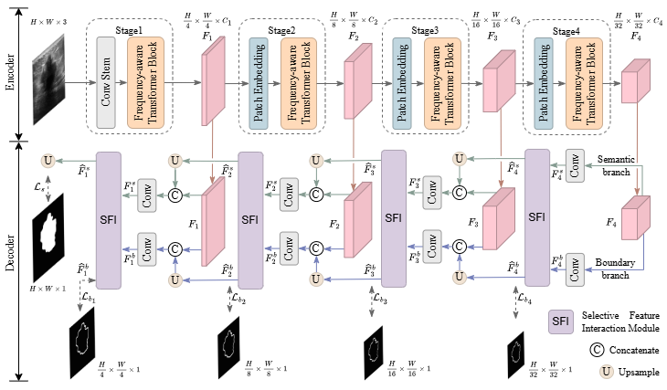

# Frequency-aware Interaction Network for Ultrasound Image Segmentation

> **Authors:**
> [Dongfang Wang](),
> [Tao Zhou](https://taozh2017.github.io/),
> [Yizhe Zhang](https://yizhezhang.com/), 
> [Shangbing Gao](), and 
> [Jian Yang](https://scholar.google.com/citations?user=6CIDtZQAAAAJ&hl=en), 

## 1. Preface

- This repository provides code for "_**Frequency-aware Interaction Network for Ultrasound Image Segmentation (FINet)**_". 
([paper](https://ieeexplore.ieee.org/document/10787068))

## 2. Overview

### 2.1. Introduction

Accurate segmentation of medical ultrasound images is crucial for guiding treatment decisions and assessing intervention effectiveness. The challenge of segmenting lesions in ultrasound images arises from factors such as low contrast, high speckle noise, artifacts, and blurred boundaries. Furthermore, this complexity varies significantly among lesions in different cases. While methods based on Convolutional Neural Networks (CNNs) and Transformers have shown promising results in this field, each approach possesses distinct advantages and limitations. To address these challenges, we propose a novel Frequency-aware Interaction Network (FINet). At the core of our FINet lies the proposed Multi-scale Frequency-aware Self-attention (MFS) module, which effectively captures multi-scale feature information within the self-attention layer. This enables our network to model both local and global features, capitalizing on the strengths of both CNNs and Transformers. Additionally, a frequency-aware network is introduced to learn the interactions between spatial locations in the frequency domain to enhance detailed feature representation such as edges. Furthermore, we present a collaborative interactive decoder network, in which a Selective Feature Interaction (SFI) module is proposed to facilitate the semantic and boundary feature interaction, resulting in more precise segmentation outcomes. Experimental results on four medical ultrasound image datasets show the superiority of our FINet over other state-of-the-art segmentation methods. More importantly, our model achieves an excellent trade-off between performance and computational efficiency.

### 2.2. Framework Overview

      
    <em> 
    Figure 1: Overview of the proposed FINet.
    </em>

## 3. Proposed Method

### 3.1. Training/Testing

The training and testing experiments are conducted using [PyTorch](https://github.com/pytorch/pytorch) with 
a single NVIDIA GeForce RTX 3090 with 24 GB of Memory.

> Note that our model also supports other GPUs, which means you can adjust the batch size.

1. Configuring your environment
    - Create conda environment: `conda create -n FINet python=3.8`
    - Activate environment：`conda activate FINet`
    - Install requirements: `pip install -r requirements.txt`

3. Downloading data
    - Download the ultrasound datasets [BUSI](https://scholar.cu.edu.eg/?q=afahmy/pages/dataset), [TN3K](https://github.com/haifangong/TRFE-Net-for-thyroid-nodule-segmentation), [TG3K](https://github.com/haifangong/TRFE-Net-for-thyroid-nodule-segmentation), and [MMOTU](https://github.com/cv516Buaa/MMOTU_DS2Net).
    - Edge maps can be referred to `./utils/edge.py`
4. Load the pre-trained parameters
    - Download the backbone checkpoint of FINet from the following [Google Drive](https://drive.google.com/file/d/1wlJEtRpn3ekdKRA_WP6tcYxREw6LNeto/view?usp=sharing) and move it into `./FINet/pretrained/`
6. Training Configuration
    - Assigning your costumed path, like `--dataset_root` and `--dataset_name` in `Train.py`
8. Testing Configuration
    - Assigning your costumed path, like `--pth_path` and `--test_save` in `Test.py`

## 4. Citation
Please cite our paper if you find the work useful: 

    @ARTICLE{10787068,
      author={Wang, Dongfang and Zhou, Tao and Zhang, Yizhe and Gao, Shangbing and Yang, Jian},
      journal={IEEE Transactions on Circuits and Systems for Video Technology}, 
      title={Frequency-Aware Interaction Network for Ultrasound Image Segmentation}, 
      year={2025},
      volume={35},
      number={7},
      pages={7020-7032},
      doi={10.1109/TCSVT.2024.3514181}}

## 5. License

The source code is free for research and educational use only. Any commercial use should get formal permission first.
